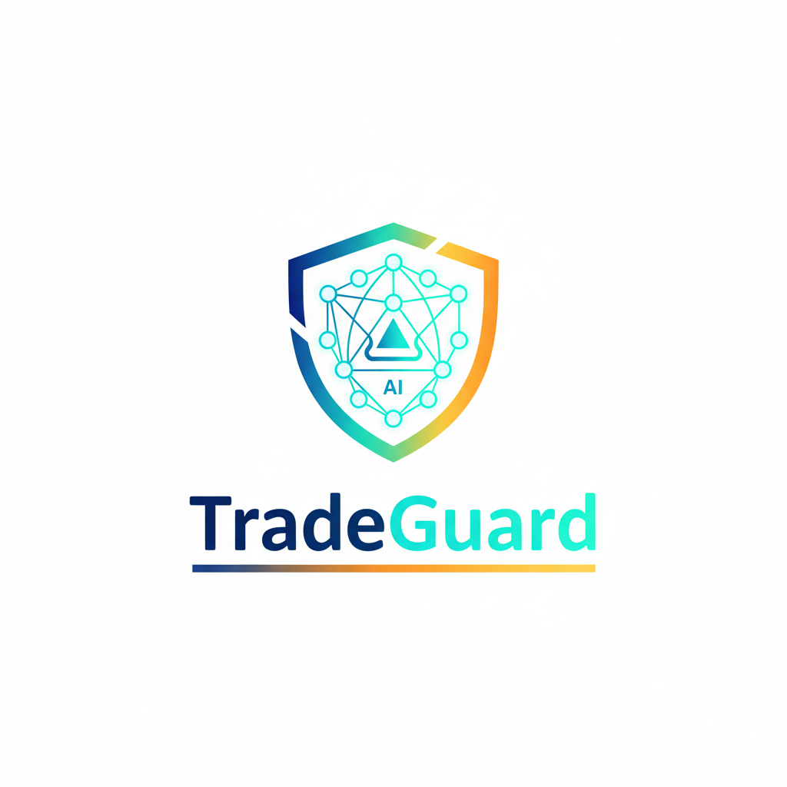

<p align="center">
  
</p>

# TradeGuard AI

TradeGuard AI is a **FastAPI-based OCR service** designed to extract text from trade documents using **Google Cloud Document AI**. It supports PDFs, images, and other common document formats. Ideal for automating trade finance workflows.

## Features
- Upload PDFs, PNG, JPG, TIFF, and JPEG files.
- Extract text automatically using Google Document AI.
- Easy-to-use web interface with preview.
- Docker-ready for quick deployment.

## Demo

[](https://youtu.be/rpeT_y0tH6s)  

_Click the image above to watch the demo on YouTube._  

[Click to view demo](assets/Demo.gif)

## Steps
1. Clone the repo:
```bash
git clone https://github.com/yourusername/TradeGuard.git
cd TradeGuard
````

2. Install dependencies:

```bash
pip install -r requirements.txt
```

3. Set up Google Cloud credentials and configure your Document AI processor:

```bash
export GOOGLE_APPLICATION_CREDENTIALS="path_to_your_service_account.json"
```

4. Update `app.py` with your GCP `PROJECT_ID`, `LOCATION`, and `PROCESSOR_ID`.

5. Run locally:

```bash
uvicorn app:app --reload --host 0.0.0.0 --port 8080
```

6. Open [http://localhost:8080](http://localhost:8080) in your browser.

## Docker Deployment

```bash
docker build -t tradeguard .
docker run -p 8080:8080 tradeguard
```

## License

MIT License
